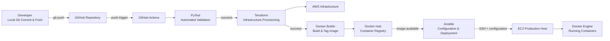
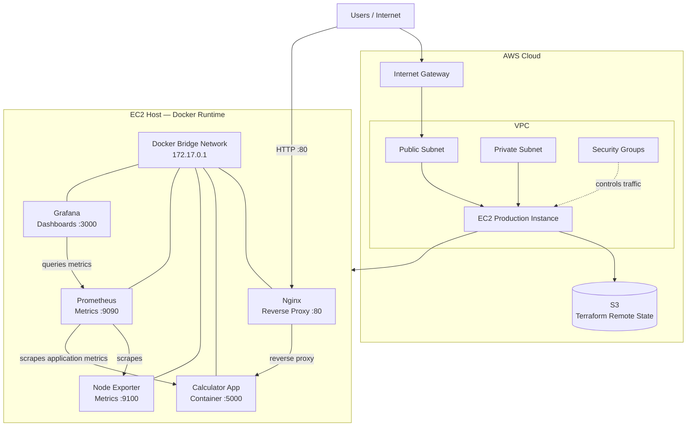

# Automated AWS CI/CD Pipeline with Terraform, Ansible & Docker

An end-to-end Continuous Integration and Continuous Deployment (CI/CD) system that automatically validates application changes, provisions AWS infrastructure, builds and publishes a Docker image, configures an EC2 host, deploys the application stack, and exposes monitoring through Prometheus and Grafana.

The project combines **CI/CD, Infrastructure as Code, configuration management, containerization, reverse proxying, and observability** into one reproducible workflow.

## 📐 CI/CD Pipeline Architecture

This diagram shows the **flow of a code change** from the developer's machine to the running application.



### Pipeline stages

1. **Validate** — GitHub Actions runs the application's PyTest test suite.
2. **Provision** — Terraform creates or updates the required AWS infrastructure and uses remote state stored in S3.
3. **Package** — Docker Buildx builds and tags the application image and pushes it to Docker Hub.
4. **Configure & Deploy** — Ansible connects to the dynamically created EC2 instance, configures the host, pulls the image, and launches the containerized stack.

## 🏗️ Runtime / Production Architecture

This is the **infrastructure and application architecture** that exists after deployment. It is separate from the CI/CD pipeline above: the first diagram explains **how changes get deployed**, while this diagram explains **what is running in production**.



### Runtime flow

```text
User
  ↓
Internet
  ↓
AWS Internet Gateway
  ↓
VPC / Subnet / Security Groups
  ↓
EC2 Instance
  ↓
Nginx :80
  ↓
Calculator Application :5000
```

Monitoring runs alongside the application:

```text
Application ───────┐
                   ├──→ Prometheus ──→ Grafana
Node Exporter ─────┘
```

## 🛠️ Core Engineering Technology Stack

| Area | Technology | Role |
|---|---|---|
| Source Control | Git / GitHub | Stores source code and triggers the workflow |
| CI/CD | GitHub Actions | Automates validation, provisioning, packaging, and deployment |
| Testing | PyTest | Validates application behaviour automatically |
| Infrastructure as Code | Terraform v1.7.0 | Provisions and manages AWS infrastructure |
| Cloud | AWS | Provides the production infrastructure |
| Remote Terraform State | Amazon S3 | Stores Terraform state remotely |
| Configuration Management | Ansible | Configures the EC2 host and performs deployment tasks |
| Containers | Docker / Docker Buildx | Packages and runs the application |
| Registry | Docker Hub | Stores and distributes the application image |
| Reverse Proxy | Nginx | Provides the public HTTP entry point and forwards traffic to the application |
| Metrics | Prometheus | Collects and stores operational metrics |
| Monitoring UI | Grafana | Visualizes metrics through dashboards |
| Host Metrics | Node Exporter | Exposes host-level metrics to Prometheus |

## 🚀 Key Architectural Automations

1. **Automated Terraform State Initialization** — The deployment workflow checks for the Terraform S3 backend and uses `terraform init -reconfigure` when required so the workflow can correctly connect to the remote state backend across runs.

2. **Dynamic Host Inventory Resolution** — Terraform outputs live EC2 instance information to GitHub Actions through `GITHUB_OUTPUT`, allowing the deployment stage to pass the current target host to Ansible without hard-coding an IP address.

3. **Automated SSH Connection Refresh** — Ansible uses `ansible.builtin.meta: reset_connection` to refresh the SSH session when required after host/network configuration changes.

4. **Docker Bridge-Based Internal Communication** — The monitoring components communicate through the Docker bridge/network rather than requiring every internal service to be exposed publicly.

## 📦 Project Structure

```text
├── .github/workflows/
│   ├── deploy.yml              # Four-stage deployment workflow
│   └── destroy.yml             # Infrastructure teardown workflow
│
├── terraform/
│   ├── main.tf                 # AWS infrastructure and networking
│   ├── variables.tf            # Infrastructure parameters
│   └── provider.tf              # Configuration settings and version requirements
│
├── ansible/
│   ├── playbook.yml            # Server configuration and deployment
│   ├── grafana_datasource.yml  # Grafana data-source provisioning
│   ├── grafana_dashboards_provider.yml
│   │                             # Grafana dashboard provider configuration
│   ├── prometheus.yml           # Prometheus scrape configuration
│   └── flask_proxy.conf         # Nginx reverse-proxy configuration
│
└── Aesthetic-Calculator-main/
    ├── Dockerfile               # Application container definition
    └── requirements.txt         # Python dependencies
```

## 🔧 Operational Configuration

The deployment workflow requires the following GitHub Actions secrets:

| Secret | Purpose |
|---|---|
| `AWS_ACCESS_KEY_ID` | AWS authentication |
| `AWS_SECRET_ACCESS_KEY` | AWS authentication |
| `ANSIBLE_SSH_KEY` | Private SSH key used by Ansible to access the EC2 host |
| `DOCKER_USERNAME` | Docker Hub authentication |
| `DOCKER_PASSWORD` | Docker Hub Personal Access Token |

Configure these under:

**GitHub Repository → Settings → Secrets and variables → Actions**

> **Security:** Never commit these values, private keys, `.pem` files, or other credentials to the repository.

## 🔄 Deployment Lifecycle

```text
Code Change
    ↓
Git Push
    ↓
GitHub Actions
    ↓
PyTest
    ↓
Terraform
    ↓
AWS Infrastructure
    ↓
Docker Buildx
    ↓
Docker Hub
    ↓
Ansible
    ↓
EC2
    ↓
Docker Containers
    ↓
Nginx → Calculator App
    ↓
Prometheus → Grafana
```

## 🎯 What This Project Demonstrates

- Automated CI/CD using GitHub Actions
- Automated application testing with PyTest
- Infrastructure as Code with Terraform
- Remote Terraform state management with S3
- AWS networking and EC2 provisioning
- Dynamic infrastructure-to-deployment handoff
- Configuration management with Ansible
- Containerized application deployment with Docker
- Private container image distribution through Docker Hub
- Nginx reverse-proxy configuration
- Infrastructure and application observability with Prometheus and Grafana
- Automated infrastructure teardown
- Reproducible deployment rather than manual server setup

## ⚠️ Scope

This is a portfolio project designed to demonstrate production-oriented DevOps practices on a small AWS deployment. The architecture intentionally keeps the infrastructure relatively simple: a single EC2 production host running the application and monitoring containers.

The project demonstrates the **engineering workflow and operational concepts** used in larger environments without claiming that this small deployment has the scale or redundancy of a large enterprise platform.
