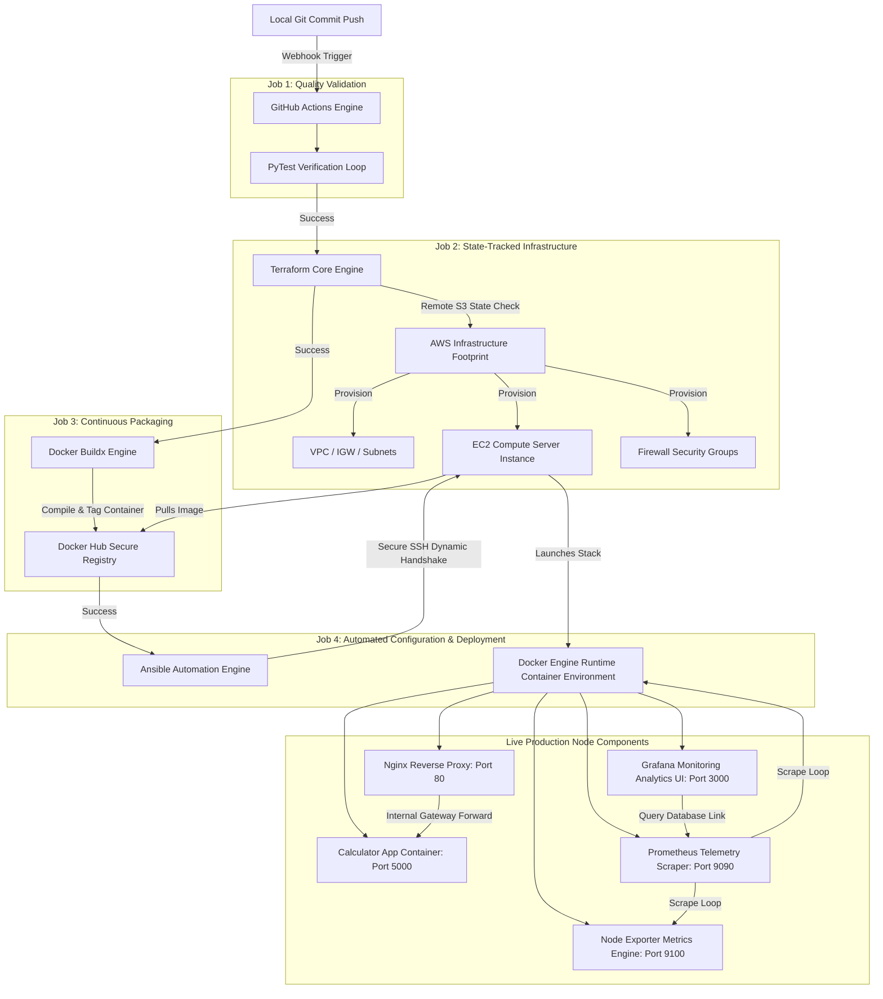

# Automated GitOps End-to-End Git-to-Cloud CI/CD Pipeline

A production-grade, state-tracked Continuous Integration and Continuous Deployment (CI/CD) ecosystem. This system builds, validates, provisions, and deploys a custom containerized Python web application stack automatically upon code execution, integrated with real-time enterprise systems monitoring and reverse proxy telemetry routing frameworks.

## 📐 Systems Architecture Layout



## 🛠️ Core Engineering Technology Spectrum
* **Pipeline Automation Orchestration:** GitHub Actions Workflow Framework
* **Infrastructure-as-Code Engine:** HashiCorp Terraform (v1.7.0)
* **Cloud Platform Footprint:** Amazon Web Services (AWS EC2, VPC, Internet Gateways, S3 Backends)
* **Configuration Management Orchestrator:** Ansible Engine Architecture
* **Container Virtualization Layers:** Docker, Docker Buildx, Containerd Engine
* **Web Entry Handling Systems:** Nginx Webserver Engine (Reverse Proxy Layer Integration)
* **Analytical Telemetry Pipeline:** Prometheus Telemetry Core & Grafana Analytical Dashboards

## 🚀 Key Architectural Automations
1. **Self-Healing S3 Remote Backend Sync:** The deployment system checks for the tracking vault dynamically via the AWS CLI and uses an initial `-reconfigure` flag to link storage states safely, preventing duplicate compute resources or server leaks on pipeline re-runs.
2. **Dynamic Host Inventory Resolution:** The infrastructure configuration outputs live instance data to cross-job pipelines via `GITHUB_OUTPUT`, mapping dynamic target tracking structures into Ansible's runtime engine without manual IP address maintenance.
3. **Automated Connection Session Refreshing:** Uses native `ansible.builtin.meta: reset_connection` logic to drop and recreate SSH connections dynamically, allowing group security adjustments to bind without breaking execution playbooks.
4. **Isolated Bridge Gateway Telemetry:** Routes operational component queries directly through the virtual Docker bridge interface (`172.17.0.1`), passing query tasks between isolated container stacks securely without open host vulnerabilities.

## 📦 Local Project Structure Reference
```text
├── .github/workflows/
│   ├── deploy.yml            # Four-Stage Production Deployment Blueprint
│   └── destroy.yml           # Single-Click Infrastructure Teardown Automation
├── terraform/
│   ├── main.tf               # AWS Compute and Automation Networking Blueprint
│   ├── variables.tf          # Machine Size and Region Parameter Mappings
│   └── outputs.tf            # Dynamic Environment Telemetry Egress
├── ansible/
│   ├── playbook.yml          # Production Server System Provisioning Configuration
│   ├── grafana_datasource.yml # Provisioned Database Link (Version-Forced)
│   ├── grafana_dashboards_provider.yml # Dynamic Dashboard Storage Provider Map
│   ├── prometheus.yml        # Telemetry Scrape Interval Configuration
│   └── flask_proxy.conf      # Nginx Virtual Server Routing Profile
└── Aesthetic-Calculator-main/ # Containerized Calculator Application Root
    ├── Dockerfile            # Application Container Build Configurations
    └── requirements.txt      # Python Package Dependency Configurations
```

## 🔧 Operational Configuration Checkpoints

To initialize this deployment infrastructure within an alternate repository, secure credentials must be set within the **GitHub Repository Settings ➡️ Secrets and variables ➡️ Actions** menu:

* `AWS_ACCESS_KEY_ID`: Active IAM user alphanumeric credential key string (`AKIA...`).
* `AWS_SECRET_ACCESS_KEY`: AWS authorization verification cryptographic token string.
* `ANSIBLE_SSH_KEY`: Raw cryptographic text contents of the private server credential key pair (`.pem` file).
* `DOCKER_USERNAME`: Authentication identity handle mapping to Docker Hub profiles.
* `DOCKER_PASSWORD`: Personal Access Token authorizing container image distribution tasks securely.
